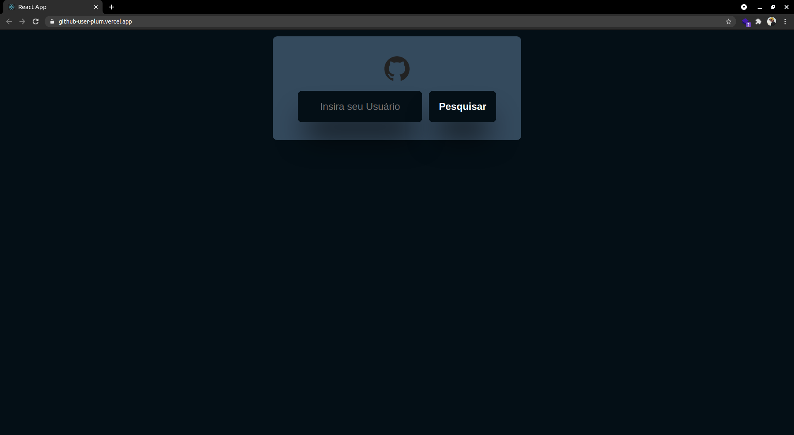
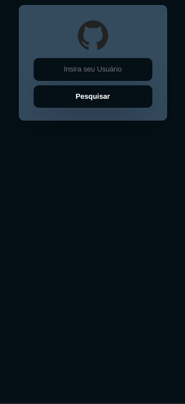

<h1 align="center">
  <a href="" rel="noopener">
  GitHub User
</h1>

Tela 1 - desktop | Tela 2 - desktop 
:-------------------------:|:-------------------------:
  |  
  |  

## 🧐 Sobre o projeto

User-GitHub é uma aplicação na qual o usuário informa o seu GitHub e retorna o perfil com seus repositórios publicos.

Objetivo: Praticar gerenciamento de estados com context api e requisição http com axios.

## ⚙️ Funcionalidades
- [x] Front-end;
  - [x] Pagina Principal;
  - [x] Busca usuário com api do GitHub
  - [x] Lista repositórios do usuário
  - [x] Responsividade
  - [x] Link de redirecionamento para aplicação ou repositório
## Como executar o projeto
### Pré-requisitos
- git 
- Node.js
- NPM ou Yarn
### Instalação
```
# Abra o terminal e copie este repositório com o comando
$ git clone https://github.com/IgorTargino/user-github.git

# Acesse a pasta do projeto no prompt de comando 
$ cd 

# Instale as dependências
yarn install
ou
$ npm install

# Execute a aplicação
$ yarn start
ou
$ npm start

# Acesse http://localhost:3000 no seu navagador.
```
## 🚀 Tecnologias 
Tecnologias utilizadas para desenvolver o projeto:
- React.js
- Typescript
- Scss
- Context API
- Axios
- React-icons
- Material-ui

## 🦸‍♂️ **Autor**

<p>
 <sub><strong>🌟 Igor Targino Marinho🌟</strong></sub>
</p>

[](https://www.linkedin.com/in/igor-targino/)
[](mailto:igortargino01@gmail.com)

>Este projeto foi desenvolvido com ❤️ por **[Igor Targino](https://github.com/IgorTargino)**💜<br> 
Se achou interessante, dá uma ⭐ que vai me ajudar 😉.
